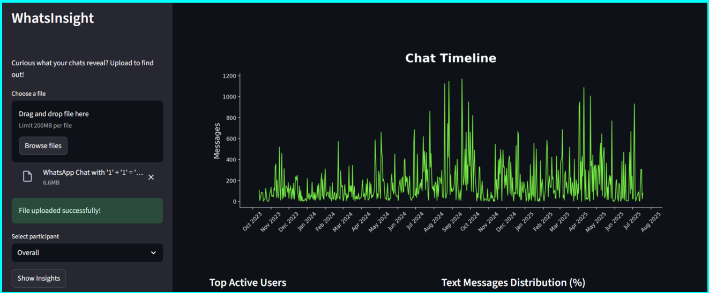

# WhatsInsight

**WhatsInsight** is an intelligent, advanced, visual analytics tool that extracts meaningful insights from WhatsApp chats. Designed with interactivity and aesthetics in mind, it enables users to explore conversational trends, behavioral patterns, and hidden dynamics in group or personal chats.

The website is deployed on Render. You can access it using https://whatsinsight.onrender.com.
Please be patient as the site may take some time in uploading and showing entire analysis.

NOTE:

- Media Categorization and counts will only be shown if chat export with media has been uploaded.

 

---

## What Does It Do?

WhatsInsight helps you answer:

- Who talks the most in the group?
- What are the most active hours?
- How fast do people respond?
- What are the dominant words used?
   and more...

All of these are visualized through bar graphs, donut graphs, pie charts, word clouds, and even chat timelines.

---

## Built With

This project is built using:

| Technology               | Purpose                                   |
| ------------------------ | ----------------------------------------- |
| **Python**               | Core logic, data processing, and plotting |
| **Streamlit**            | Interactive web app interface             |
| **Pandas**               | Data wrangling & preprocessing            |
| **Matplotlib & Seaborn** | Elegant charting & visualizations         |
| **NumPy**                | Efficient numerical computations          |
| **Regular Expressions**  | Message parsing and pattern matching      |
| **WordCloud**            | Natural word visualizations               |
| **Datetime**             | Time-based aggregations and insights      |

---

## Sample Visualizations

<h3>Chat Timeline</h3>

<h3>User Analysis</h3>

<h3>Word Cloud</h3>

---

## Why Use WhatsInsight?

- No-code interface: Just upload your exported chat file and explore.
- Visual-first: Focused on intuitive plots.
- Scalable: Works with large groups or 1-on-1 chats.
- Modular design: Easy to extend with future features like sentiment/semantic analysis.

---

## How to Export Your WhatsApp Chat

To use WhatsInsight, you’ll need to export a chat from WhatsApp. Here’s how:

### On Mobile (Android or iPhone):

1. Open **WhatsApp** and go to the **chat** (individual or group) you want to analyze.
2. Tap the **3-dot menu (⋮)** or the **chat name** at the top.
3. Select **More** > **Export Chat**.
4. Choose whether to:
   - **Without Media**
   - **With Media**
5. Share the exported `.txt` file to your email, Google Drive, or other means to access it from your computer.

> **Important:** Do **not modify** the `.txt` file before uploading it to WhatsInsight.

---

## Coming Soon

- **Semantic Analysis** of messages
- Deployment-ready builds on the cloud
- Customizable themes and exports

---

Turn your WhatsApp chats into powerful insights with WhatsInsight.

**Made by Arko Dasgupta**

_To run this on your own machine, please refer to [setup.md](setup.md)_
